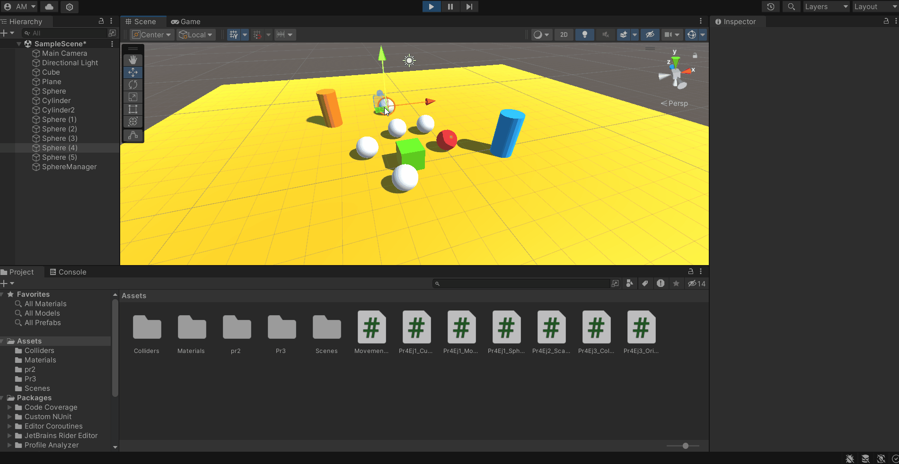

# ii-practica4-delegados-eventos

## Ejercicio 1

- Detectamos la colisión entre el cubo y el cilindro con `OnCollisionEnter()` y lo notificamos.
- Manejamos qué le sucede a las esferas con un script manejador que está suscrito al objeto notificador.
- El manejador:
	- Cambia el color de las esferas del grupo 1.
	- Cambia la velocidad de movimiento hacia el cilindro del grupo 2 (0 al inicio).

## Ejercicio 2

- El cubo maneja las notificaciones. Tiene dos tipos, cuando colisiona con un objeto del grupo 1 y cuando choca contra cualquier otra cosa.
- El manejador de las esferas responde a las notificaciones, cambiando la escala y la velocidad de acercamiento de los respectivos grupos.
- Cada esfera utiliza los valores declarados en el manejador según el grupo en el que se encuentre.

## Ejercicio 3

- El cilindro notifica cuando el cubo se acerca.
- Las esferas responden según su grupo:
	- Grupo 1: Cambian a un color aleatorio y se impulsan hacia arriba.
	- Grupo 2: Se orientan con `LookAt()` hacia el segundo cilindro.

## Ejercicio 4

El cubo detecta la colisión con las esfera, suma puntos según el grupo de la esfera y elimina la esfera del juego.

## Ejercicio 5

Para mostrar la puntuación tenemos un canvas con texto.

## Ejercicio 6

He creado un pequeño circuito para completar usando una esfera y los controles *WASD*.
- El **objetivo** es llegar a la pequeña esfera final verde.
- La esfera final manda un mensaje cuando finaliza la partida.
- El texto en pantalla (inicialmente vacío) y la esfera que controlamos están suscritos a la esfera final.
- Cuando se manda el mensaje de fin de partida, el texto se revela y la esfera inicial deja de moverse (se eliminan el script de movimiento y su *Rigidbody*).
- Con otro script hacemos que cuando la esfera caiga vuelva a su posición inicial.

